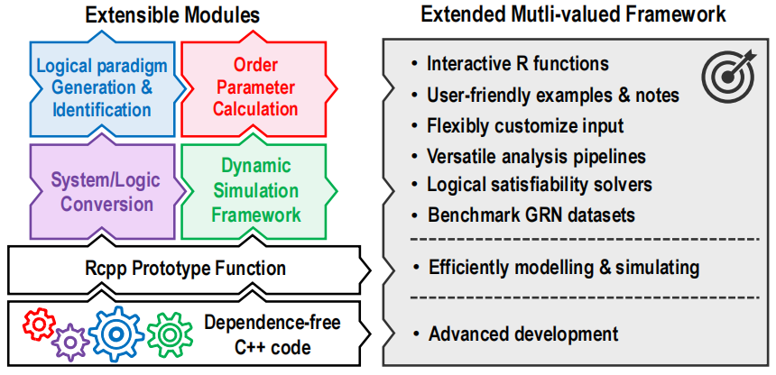

# BioLogical: a universal logical-based analysis framework for biological complex systems

## **Brief Introduction**
`BioLogical` is a user-friendly R package, designed for analyzing various logical-based properties of biosystems. 
Its versatile capacities include deciphering multi-valued logical paradigms, calculating order parameters, 
and simulating system dynamic, even multi-valued Quine-McCluskey and logical satisfiability analysis. It also 
integrates current Boolean gene regulatory network data to enable users to simulate quickly. `BioLogical` extends 
classic concepts and algorithms to multi-valued scenarios and provides logical satisfiability solvers, 
thereby addressing the limitations of existing Boolean related packages. Its framework structure and functional modules 
are shown in Figure 1. For detailed concepts, algorithms, and settings, please refer to the manuscripts [Be updated later].

  
   
  
Figure 1: Framework and modules of BioLogical

## **Dependency** 
`Biological` minimize dependencies on the environment and other libraries, eliminating cumbersome environment configuration as soon as possible.
- **Depends** : `R` ($\geqslant$ 3.5.0)
- **Imports** : `Rcpp` ($\geqslant$ 1.0.10), `ggplot2` ($\geqslant$ 3.4.0)
- **Suggest** : `igraph` ($\geqslant$ 2.0.2)
- **c++ standard** : $\geqslant$ C++11
- **Z3solver c++ library ?Microsoft** : 4.12.5 (Newest versions in 2024Jan, embedded in the package)

## **Installation** 
Run the following codes and commands in `R` to install. If library `devtools` is not available on your machine, 
you can download corresponding source code compressed files for local installation. We also provide precompiled 
files for convenient installation and use (See `Releases`). Please ensure the compatibility of platforms and versions.

### Linux:
- `devtools::install_github("YuxiangYao/BioLogical/pkgs/BioLogical_linux/")`
- Download the compressed files of the source code.

   `download.file("https://github.com/YuxiangYao/BioLogical/refs/heads/main/pkg_source/BioLogical_0.1.17_linux.tar.gz", "BioLogical_0.1.17.tar.gz")`
  
   `install.packages("/your/directory/to/file/BioLogical_0.1.17.tar.gz", repos=NULL)`

### Windows:
- `devtools::install_github("YuxiangYao/BioLogical/pkgs/BioLogical_win/")`
- Download the compressed files of the source code.

   `download.file("https://github.com/YuxiangYao/BioLogical/refs/heads/main/pkg_source/BioLogical_0.1.17_win.tar.gz", "BioLogical_0.1.17.tar.gz")`
  
   `install.packages("/your/directory/to/file/BioLogical_0.1.17.tar.gz", repos=NULL)`

### Mac:
- `devtools::install_github("YuxiangYao/BioLogical/pkgs/BioLogical_mac/")`
- Download the compressed files of the source code.

   `download.file("https://github.com/YuxiangYao/BioLogical/refs/heads/main/pkg_source/BioLogical_0.1.17_mac.tar.gz", "BioLogical_0.1.17.tar.gz")`
  
   `install.packages("/your/directory/to/file/BioLogical_0.1.17.tar.gz", repos=NULL)`

> [!NOTE]
> - Considering the differences of OS, it is recommended to compile source codes for installation.
> - We have tested BioLogical on Ubuntu 20.04.1, Windows 10, and macOS 13. The compatibility with older operating system versions remains unknown. We welcome reports of any bugs or issues.
> - Your computer needs to have installed corresponding C++ compilers and R development tools, such as `gcc` (Linux), `Rtools` (Win), `Xcode` (Mac). Please confirm that their file directory are in the `PATH`. Generally, if you have previously installed other `R` packages based on C/C++ source code, you may ignore these configurations.
> - Due to the different architecture of `Z3` library, a small part of solutions for logical satisfiability analysis vary
> slightly across the three platforms; while all those solutions satisfy the functional requirements.

> [!TIP]
> Numerous step-by-step examples can guide you to conveniently begin your analysis.
> For large-scale system simulations, it is recommended to employ prototype function (`c_*`) to speed up analyses.

## **Questions & Bug Report** 
For any question about the package, please report bugs in ISSUE or contact Yuxiang Yao, Email: y.x.yao@foxmail.com